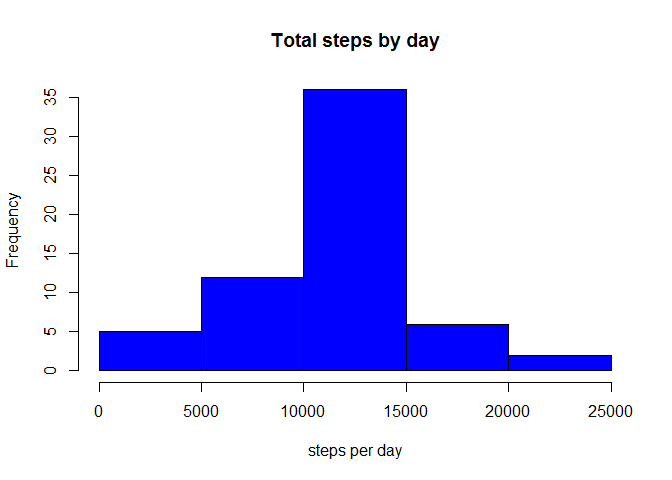

# Reproducible Research: Peer Assessment 1
Lalita  
Friday, November 13, 2015  


## Loading and preprocessing the data
Load Data:


```r
unzip(zipfile="activity.zip")
stepcount<- read.csv( "activity.csv")
str(stepcount)
```

```
## 'data.frame':	17568 obs. of  3 variables:
##  $ steps   : int  NA NA NA NA NA NA NA NA NA NA ...
##  $ date    : Factor w/ 61 levels "2012-10-01","2012-10-02",..: 1 1 1 1 1 1 1 1 1 1 ...
##  $ interval: int  0 5 10 15 20 25 30 35 40 45 ...
```
Process data:

```r
stepcount$date <- as.Date(stepcount$date, "%Y-%m-%d")
stepcount$interval <- as.factor(stepcount$interval)
str(stepcount)
```

```
## 'data.frame':	17568 obs. of  3 variables:
##  $ steps   : int  NA NA NA NA NA NA NA NA NA NA ...
##  $ date    : Date, format: "2012-10-01" "2012-10-01" ...
##  $ interval: Factor w/ 288 levels "0","5","10","15",..: 1 2 3 4 5 6 7 8 9 10 ...
```

## What is mean total number of steps taken per day?
For this part of the assignment, you can ignore the missing values in the dataset.

Total number of steps taken per day:

```r
library(lattice)
total_steps <- aggregate(steps ~ date, data = stepcount, sum, na.rm = TRUE)
```
Draw a histogram of the total number of steps taken each day:

```r
hist(total_steps$steps, breaks= 5, main = "Total steps by day", xlab = "total steps in a day", col = "red")
```

 

Display mean and median of the total number of steps taken per day:

```r
mean(total_steps$steps)
```

```
## [1] 10766.19
```

```r
median(total_steps$steps)
```

```
## [1] 10765
```


## What is the average daily activity pattern?

Make a time series plot (i.e. type = "l") of the 5-minute interval (x-axis) and the average number of steps taken, averaged across all days (y-axis).
Average Number of Steps:

```r
time_series <- tapply(stepcount$steps, stepcount$interval, mean, na.rm = TRUE)
plot(row.names(time_series), time_series, type = "l", xlab = "5-min interval", 
     ylab = "Average across all Days", main = "Average number of steps taken", 
     col = "blue", lwd = 2)
```

 

Which 5-minute interval, on average across all the days in the dataset, contains the maximum number of steps?
Maximum number of steps:

```r
max_interval <- which.max(time_series)
names(max_interval)
```

```
## [1] "835"
```

## Imputing missing values

Calculate and report the total number of missing values in the dataset (i.e. the total number of rows with NAs)

```r
stepcount_NA <- sum(is.na(stepcount))
stepcount_NA
```

```
## [1] 2304
```

Devise a strategy for filling in all of the missing values in the dataset. The strategy does not need to be sophisticated. For example, you could use the mean/median for that day, or the mean for that 5-minute interval, etc.
Fill Missing Values:

```r
avg_steps <- aggregate(steps ~ interval, data = stepcount, FUN = mean)
na_fill <- numeric()
for (i in 1:nrow(stepcount)) {
  obs <- stepcount[i, ]
  if (is.na(obs$steps)) {
    steps <- subset(avg_steps, interval == obs$interval)$steps
  } else {
    steps <- obs$steps
  }
  na_fill <- c(na_fill, steps)
}
```
Create a new dataset that is equal to the original dataset but with the missing data filled in.
New Dataset:

```r
full_data <- stepcount
full_data$steps <- na_fill
```

Make a histogram of the total number of steps taken each day.
Histogram:

```r
new_total_steps <- aggregate(steps ~ date, data = full_data, sum, na.rm = TRUE)
hist(new_total_steps$steps, breaks = 5, main = "Total steps by day", xlab = "steps per day", col = "blue")  
```

 
Calculate and report the mean and median total number of steps taken per day. Do these values differ from the estimates from the first part of the assignment? What is the impact of imputing missing data on the estimates of the total daily number of steps?
Mean:

```r
mean(new_total_steps$steps)
```

```
## [1] 10766.19
```
Median:

```r
median(new_total_steps$steps)
```

```
## [1] 10766.19
```
Not a significant difference in the mean and median when we filled in the missing values. However, the frequency of days has changed. For example, for the mean the frequency previously was just 15 whereas in the new dataset, it is over 25.


## Are there differences in activity patterns between weekdays and weekends?
By Day of the week:


```r
day <- weekdays(stepcount$date)
dayofweek <- vector()
for (i in 1:nrow(stepcount)) {
  if (day[i] == "Saturday") {
    dayofweek[i] <- "Weekend"
  } else if (day[i] == "Sunday") {
    dayofweek[i] <- "Weekend"
  } else {
    dayofweek[i] <- "Weekday"
  }
}
stepcount$dayofweek <- dayofweek
stepcount$dayofweek <- factor(stepcount$dayofweek)

stepsPerDay <- aggregate(steps ~ interval + dayofweek, data = stepcount, mean)
names(stepsPerDay) <- c("interval", "dayofweek", "steps")


xyplot(steps ~ interval | dayofweek, stepsPerDay, type = "l", layout = c(1, 2), 
       xlab = "Interval", ylab = "Number of steps")     
```

 

The charts above show that there is more activity early on weekdays (compared to weekends)
On weekends there is less activity early in the morning, but much more during the rest of the day (compared to the weekdays)
